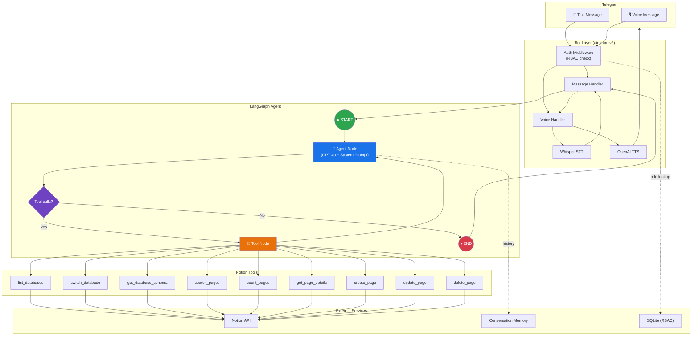

# NotionBot — Telegram AI Agent for Notion

A Telegram chatbot powered by an AI agent (OpenAI GPT-4o) that lets you manage Notion databases through natural language — text or voice.

## Features

- **Natural Language CRUD** — Ask the bot to search, create, update, or delete entries using plain English
- **Voice Support** — Send voice messages; get text + voice responses (STT via Whisper, TTS via OpenAI)
- **Dynamic Database Discovery** — Automatically discovers all Notion databases shared with the integration
- **Role-Based Access Control** — Admin, User, and Viewer roles with different permissions
- **Conversation Memory** — Maintains context across messages per user
- **AI Agent with Tools** — LangGraph-based agent that reasons about which Notion operations to perform

## Tech Stack

| Component | Technology |
|-----------|-----------|
| Bot Framework | aiogram v3 |
| AI Agent | LangGraph + LangChain |
| LLM | OpenAI GPT-4o |
| Voice | OpenAI Whisper (STT) + TTS |
| Notion API | notion-client SDK |
| Database | SQLite (aiosqlite) |
| Config | pydantic-settings |

## Setup

### 1. Prerequisites

- Python 3.12+
- A [Telegram Bot Token](https://core.telegram.org/bots#botfather)
- An [OpenAI API Key](https://platform.openai.com/api-keys)
- A [Notion Integration Token](https://www.notion.so/my-integrations)
- ffmpeg (for voice message processing)

### 2. Create Notion Integration

1. Go to [My Integrations](https://www.notion.so/my-integrations)
2. Create a new integration
3. Copy the Internal Integration Token
4. Share your Notion databases with the integration (open DB → ⋯ → Connections → select your integration)

### 3. Configure Environment

```bash
cp .env.example .env
# Edit .env with your tokens
```

Required variables:
```
TELEGRAM_BOT_TOKEN=your-telegram-bot-token
OPENAI_API_KEY=your-openai-api-key
NOTION_API_TOKEN=your-notion-integration-token
ADMIN_USER_IDS=your-telegram-user-id
```

### 4. Install & Run

**Local:**
```bash
pip install -e ".[dev]"
python -m src.main
```

**Docker:**
```bash
docker-compose up -d
```

## Usage

### Commands

| Command | Description |
|---------|------------|
| `/start` | Welcome message and overview |
| `/help` | Detailed help and examples |
| `/databases` | List available Notion databases |
| `/use <name>` | Select active database |
| `/clear` | Reset conversation history |

### Admin Commands

| Command | Description |
|---------|------------|
| `/adduser <id> <role>` | Add a user (admin/user/viewer) |
| `/removeuser <id>` | Remove a user |
| `/setrole <id> <role>` | Change user role |
| `/users` | List all registered users |

### Natural Language Examples

- "Show me all databases"
- "List tasks with status In Progress"
- "Add a new task: Review PR, priority 1, due Friday"
- "Update the status of 'Fix login bug' to Done"
- "Delete the task called 'Old meeting notes'"
- Send a voice message: "What tasks are due this week?"

### Roles

| Role | Permissions |
|------|------------|
| **admin** | Full CRUD + user management |
| **user** | Full CRUD on accessible databases |
| **viewer** | Read-only (list, search, view) |

## Agent Workflow



**Node descriptions:**

| Node | Role |
|------|------|
| **Auth Middleware** | Validates Telegram user against SQLite DB; injects `user_role` |
| **Agent Node** | Constructs a dynamic system prompt (role, active DB schema, permissions) and calls GPT-4o |
| **Decision** | If the LLM response contains `tool_calls` → route to Tool Node; otherwise → END |
| **Tool Node** | Executes the requested Notion tool(s) and returns results back to the Agent |
| **Conversation Memory** | Per-user message history fed into every Agent invocation |

**Role → Tool access:**

| Role | Available Tools |
|------|----------------|
| **admin / user** | All 9 tools (full CRUD) |
| **viewer** | 6 read-only tools (`list_databases`, `switch_database`, `get_database_schema`, `search_pages`, `count_pages`, `get_page_details`) |

## Project Structure

```
src/
├── main.py              # Entry point
├── config.py            # Configuration
├── agent/
│   ├── graph.py         # LangGraph agent
│   ├── state.py         # Agent state
│   ├── persona.py       # AI system prompt
│   ├── memory.py        # Conversation memory
│   └── tools/
│       └── notion_tools.py  # Notion CRUD tools
├── notion/
│   ├── client.py        # Async API wrapper
│   ├── discovery.py     # DB discovery & caching
│   ├── operations.py    # CRUD operations
│   ├── query_builder.py # Filter/sort builders
│   └── models.py        # Pydantic models
├── voice/
│   ├── stt.py           # Speech-to-text
│   └── tts.py           # Text-to-speech
├── bot/
│   ├── bot.py           # Bot setup
│   ├── middleware/
│   │   └── auth.py      # RBAC middleware
│   └── handlers/
│       ├── start.py     # /start, /help, /clear
│       ├── admin.py     # User management
│       ├── db.py        # /databases, /use
│       ├── message.py   # Text → Agent
│       ├── voice.py     # Voice → STT → Agent → TTS
│       └── callback.py  # Inline keyboards
└── db/
    └── database.py      # SQLite RBAC
```

## Testing

```bash
pip install -e ".[dev]"
pytest
```

## License

MIT
